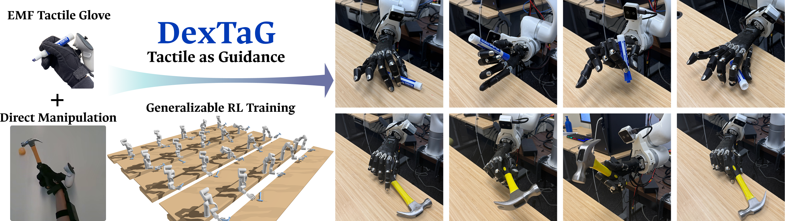

# DexTaG: Tactile-as-Guidance in Reinforcement Learning for Dexterous Manipulation

**[Project page](https://dextag.github.io/)**

[Han Yang](https://hanyangclarence.github.io/)<sup>1</sup>,
[Yian Wang](https://wangyian-me.github.io/)<sup>1</sup>,
[Yunlong Song](https://yunlong-song.com/)<sup>2</sup>,
[Zhenjia Xu](https://zhenjiaxu.com/)<sup>2</sup>,
[Chuang Gan](https://people.csail.mit.edu/ganchuang/)<sup>1</sup>

<sup>1</sup>UMass Amherst &nbsp;&nbsp; <sup>2</sup>Genesis AI



This is the official code for DexTaG. DexTaG learns dexterous tool use, such as
picking up and reorienting a marker pen or a hammer, from demonstrations recorded
with a tactile motion-capture glove. The glove's tactile readings guide
reinforcement learning toward how the human actually held the object. The learned
policy is then distilled into a controller that runs on a real xArm7 with a WUJI
hand, without any tactile input.

This repository contains the simulation training, built on
[Genesis](https://github.com/hanyangclarence/Genesis/tree/yh-041-tactile-map):

- **Retargeter (teacher):** trained with reinforcement learning on all recorded
  demonstrations of one object, with rewards for matching the glove's tactile readings.
- **Student controller:** distilled from the retargeter. It follows a target object
  trajectory using only what the real robot can sense.

The simulated tactile sensor comes from our
[Genesis fork](https://github.com/hanyangclarence/Genesis/tree/yh-041-tactile-map), which the install step
pulls in automatically.

## Install

```bash
curl -LsSf https://astral.sh/uv/install.sh | sh
uv sync
source .venv/bin/activate
```

## Data and checkpoints

**Demonstration data:** [dextag_trajectories.zip](https://drive.google.com/file/d/17gkLgZad7WZxZLt9SvIQ_VP64L53H0eP/view?usp=sharing)
(209 MB). Each demonstration is a preprocessed hand-object trajectory recorded with
the tactile glove, paired frame by frame with the glove's real 24x32 tactile map.
The zip holds these trajectories and each object's collision mesh, in
`marker_pen/pickles_filtered/` and `hammer_mixed/pickles_filtered/`. Unzip it
anywhere and pass the object's folder as `--env.object_config.trajectory_path`.

**Pretrained retargeters:**
[marker pen](https://drive.google.com/file/d/1TX5gRLLzj9hAsjoBLCIatOT3ONt2fQrl/view?usp=sharing)
and [hammer](https://drive.google.com/file/d/1PjSGp8IZ8ohfCW-SgcIfSr4WMnR1m4iN/view?usp=sharing)
(21 MB each). Unzip them at the repository root; they unpack to
`logs/mp0917_oldgf_s3/` and `logs/hm0917_oldgf_s3/`. Use those names as `--exp_name`
to evaluate them (step 2), or as `--teacher_exp_name` to distill a student (step 3).

## Usage

Run every command from the repository root, and point
`--env.object_config.trajectory_path` at an object's trajectory folder from the
demonstration data.

### 1. Train the retargeter

```bash
python scripts/policy/run_ppo_single_hand_retargeting.py \
    --exp_name=my_run --object_name=marker_pen \
    --env.object_config.trajectory_path=/path/to/pickles_filtered \
    --num_envs=3072 --runner.total_iterations=15000
```

`--object_name` is `marker_pen` or `hammer`. Checkpoints are written to
`logs/<exp_name>/`, and `--resume_checkpoint=latest` resumes a run.

### 2. Evaluate and render

```bash
python scripts/policy/run_ppo_single_hand_retargeting.py \
    --exp_name=my_run --object_name=marker_pen \
    --env.object_config.trajectory_path=/path/to/pickles_filtered \
    --eval=True --save_trajectory=True --num_runs_per_traj=1 --use_wandb=False
```

This prints success and completion rates and saves rollouts to
`deploy/logs/<exp_name>/trajectories/`. To render one as a scene video and a
tactile-map video:

```bash
python scripts/visualization/render_rollout_with_tactile_frames.py \
    --npz deploy/logs/my_run/trajectories/episode_0000_<id>.npz \
    --output-dir /tmp/viz --object-mesh-dir /path/to/pickles_filtered \
    --object-id marker_pen_scanned
```

### 3. Distill the student controller

```bash
python scripts/policy/run_bc_single_hand_retargeting.py \
    --teacher_exp_name=my_run --exp_name=my_run_bc \
    --env.object_config.trajectory_path=/path/to/pickles_filtered --num_envs=2048
```

The student's environment is built from the retargeter's saved configuration
(object, rewards, and hand setup), so those settings don't need to be repeated.
To evaluate the student, rerun the same command with
`--eval=True --save_trajectory=True --num_runs_per_traj=1 --use_wandb=False`.

## Adding a new embodiment

The code targets an xArm7 with a WUJI hand. Using another dexterous hand on the
xArm7 takes a robot model, tactile files for the hand, demonstrations retargeted to
it, and two config entries.

**1. Robot model.** Build a URDF of the arm with your hand attached to the arm's
flange (`link_eef`) by a fixed joint. Put it under
`assets/robot/`.

**2. Tactile points and pixel mapping.** Place tactile points on the hand and map
them onto the glove's 24x32 tactile map with the tactile pipeline in our
[Genesis fork](https://github.com/hanyangclarence/Genesis/tree/yh-041-tactile-map),
passing your URDF with `--urdf`. Before the mapping step, add your hand's links to
`examples/tactile/tactile_layout.py`, which places each link in the 2D view you
pair with glove pixels. The pipeline produces a tactile grid and a pixel mapping
(two JSON files).

**3. Demonstrations.** Retarget the glove recordings to your hand. Our data is
retargeted to the WUJI hand, but it keeps the human wrist and fingertip
trajectories, so you can retarget from those with your own pipeline. Each `.pkl` needs:
- `hand_trajectory`: `wrist_positions` and `wrist_rotations_aa` (the world pose of
  the hand's root link), and `dof_positions` (hand joint angles, in the joint order
  of your robot config);
- `object_trajectory.pose_matrices`, `mano_reference` (fingertip positions and
  orientations), `tactile_map`, and `metadata.obj_id`;
- the object mesh `<obj_id>_collision.obj` in the same folder.

**4. Robot config.** In `src/env/gs_env/sim/robots/config/registry.py`, add an entry
modeled on `xarm_wuji_hand`:
- the URDF path;
- the hand joints and their default angles (`default_gripper_dof`);
- joint gains and force limits;
- `ee_link_name`, the hand's root link;
- `tcp_offset` and `tcp_yaw`, the hand root's pose relative to the arm flange;
- the two tactile JSON paths.

**5. Environment config.** In `src/env/gs_env/sim/envs/config/registry.py`, copy
`single_hand_retargeting_tactile_map_xarm` with your robot entry. Set:
- `joint_mapping`, from each demonstration fingertip to your fingertip link;
- `tactile_fingertip_link_names`;
- the per-finger reward settings.

If the number of hand joints changes, also update the network input sizes in
`src/agent/gs_agent/modules/config/registry.py`; the comments show how each is
computed.

Then train with your environment entry:

```bash
python scripts/policy/run_ppo_single_hand_retargeting.py \
    --env_name=my_hand_env --exp_name=my_hand --object_name=marker_pen \
    --env.object_config.trajectory_path=/path/to/my_hand/pickles_filtered
```

**Harder cases.**
- **A hand without exactly five fingertips:** the environment's fingertip checks and
  the fingertip rewards assume five fingertips.
- **An arm other than the xArm7:** the arm's IK uses the bundled xArm7 library. It
  only places the arm at the first frame of each episode, but a new arm still needs a
  robot class with its own IK. The arm's
  link names (used to detect arm contact) and the wrist camera's link also need
  updating.
- **The visualization scripts:** the xArm7 and WUJI joint names and URDFs are set at
  the top of each script.

## Acknowledgements

This code is built on [Genesis](https://github.com/Genesis-Embodied-AI/Genesis) and
started from [GenesisPlayground](https://github.com/yun-long/GenesisPlayground).

## License

MIT. See [LICENSE](LICENSE).
